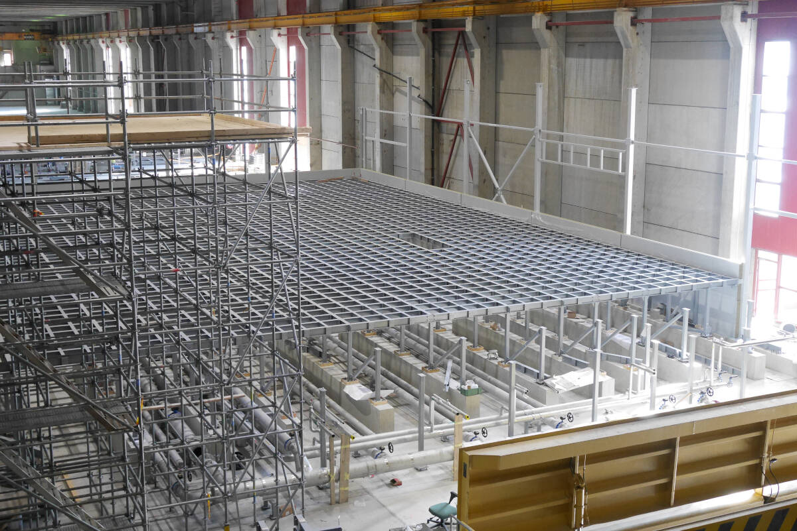

---
title: "Sieć dla superkomputera"
author: [Aleksanda Hein, Wiktor Kawka, Błażej Smorawski]
date: "11.05.2023"
keywords: [Markdown, Linux]
titlepage: true
titlepage-color: "3C9F53"
titlepage-text-color: "FFFFFF"
titlepage-rule-color: "FFFFFF"
titlepage-rule-height: 2
...

# Warunki początkowe
 1. Dla tego komputera powstanie nowy budynek o powierzchni około 800m2

# Plan budynku

### Pomieszczenia
 1. Pomieszczenie dla węzłów obliczeniowych
 2. Pomieszczenie dla ochrony
 3. Magazyn
 4. Schowek dla osób dbających o porządek
   
# Sieci
### Sieć Obliczeniowa

Celem sieci obliczeniowej jest dostarczenie szybkiego połączenia pomiędzy wszystkimi węzami obliczeniowymi klastra. Podstawowym medium komunikacyjnym jest **InfiniBand** wykorzystując złącze **QSFP56** z prędkością **HDR**. Każda grupa będzie wyposażona w pięć przełączników *NVIDIA MQM8790-HS2R Quantum HDR InfiniBand Switch* w rozmiarze 1U wyposażone w 40 portów wyjściowych. 

Urządzenia zostały wybrane ze względu na wykorzystanie w węzłach obliczeniowych akceleratrów firmy NVidia, co umożliwia ścisłą współpracę pomiędzy nimi i wykorzystanie protokołu **SHARP** służącego do wykonywania obliczeń **\`in network\`**. Przykładem jest operacja redukcji buforów między urządeniami, która może zostać wykonana na pierwszym napotkanym przełączniku, co znacznie zmniejsza obciążenie sieci oraz zwalnia zasoby węzłów obliczeniowych.

Przełączniki dodatkowo gwarantują nam nieprzerwaną dostępność i możliwość realizowania napraw w trakcie pracy urządzenia:

 - 1+1 zasilaczez z możliwością **\`hot plug\`**
 - N+1 redundantne wentylatory z możliwością **\`hot plug\`**
 - certyfikowane zasilacze **80 gold+**

Cztery przełączniki w grupie 128 węzłów są podłączone do 32 węzłów obliczeniowych każdy, a pozostałe 8 portów jest wykorzystanych do połączenia z pozostałymi przełącznikami w grupie dwoma zaagregowanymi łączami. Piąty przełącznik to przełącznik wyjściowy grupy, którego 8 portów łączy się z przełącznikami grupy, a 30 pozostałych przez łącza optyczne z 15 innymi grupami w gęstym połączeniu każdy z każdym.

Wybrane zostały przewody firmy NVidia ze względu na:

 - Zgodność z **InfiniBand HDR**
 - Przepływność **200 Gb/s**
 - BER lepsze niż **1e-15**

Potrzebny sprzęt:

 - Przełącznik *NVIDIA MQM8790-HS2R Quantum HDR InfiniBand Switch* x 16 x 5 = **80**
 - Przewody miedziane *NVIDIA MCP1650-H00AE30 DAC 1m* x 2048 + 16 * 4 * 4 * 2  = **2560**
 - Przewody optyczne *NVIDIA MFS1S00-H015V AOC 15m* x 16 x 15 = **240**

### Administracyjna

Sieć administracyjna jest siecią odseparowaną fizycznie od sieci, która pozwala nam na kontrolowanie pracy klastra bez wpływu na jego parametry obliczeniowe. Ze względu na mniejsze wymagania wydajnościowe będzie to sieć **Ethernetowa**.

Wybraliśmy przełączniki firmy *NVidia* ze względu na bardzo dobre zdolności telemetryczne, niskie opóźnienia i złożone mechanizmy zarządania ruchem. 

Każda grupa będzie wyposażona w pięć 64. portowych ethernetowych przełączników *NVIDIA MSN4600-CS2F Spectrum-3 100GbE 2U Open Ethernet Switch*. Tak jak wcześniejsze przełączniki są wyposażone w 2 zasilacze i N+1 wymienialnych wentylatorów.

Wybrane przewody to *NVIDIA MCP2M00-A005E26L DAC 5m* oraz
*NVIDIA MCP1650-V001E30 DAC 1M*.

Potrzebny sprzęt:

 - Przełącznik *NVIDIA MSN4600-CS2F Spectrum-3 100GbE 2U Open Ethernet Switch* x 16 x 4 = **64**
 - Przewody miedziane *NVIDIA MCP1650-V001E30 DAC 1m* x **2560**
 - Przewody miedziane *NVIDIA MCP2M00-A005E26L DAC 5m* x 16 x 15 = **480**

### Bezpieczeństwa

Do zadań realizowanych przez sieć bezpieczeństwa należą:
- monitorowanie budynku za pomocą kamer
- kontrola dostępu do budynku, jak i jego poszczególnych pomieszczeń za pomocą kart
- monitorowanie i regulacja temperatury w pomieszczeniu, w którym znajduje się superkomputer
- monitorowanie i powiadamianie o włamaniach do budynku
- wykrywanie i powiadamianie o pożarze w budynku
- wyświetlanie obrazu z kamer i danych z czujników na komputerach pracowników

Potrzebne urządzenia:
- 25 kamer do monitoringu,
- 7 czytników NFC oraz kart dla każdego pracownika budynku,
- 12 czujników temperatury,
- 8 urządzeń chłodzących i 8 urządzeń pobierających ciepło,
- 40 czujników antywłamaniowych,
- 20 czujników dymu.

Wybranym medium komunikacyjnym jest kabel Ethernet kategorii 5E. Dokonano takiego wyboru, gdyż medium to zapewnia wystarczającą przepustowość oraz zasięg. 

Potrzebny sprzęt:
- przewody miedziane Ethernet kat.5E -> 3800m
- 6 przełączników *Cisco CBS350-48T-4X-EU Managed 48-port GE*
- 6 podwójnych gniazdek Ethernet *Alantec 2xRJ45 IP54* 

### Dostępowa

Celem sieci dostępowej jest zapewnienie dostępu z sieci internet do dwóch węzłów obliczeniowych pełniących rolę węzłów dostępowych. Firma telekomunikacyjna dostarcza dostarcza  nam 8 łącz ethernetowych **200Gb**. Routery są bezpośrednio połączone dwoma optycznymi przewodami *NVIDIA MFS1S00-H015V AOC 15m* do każdego węzła dostępowego. Taka instalacja pozwala nam na osiągnięcie łącza rzędu **400Gb/s** do jednego węzła dostępowego, co może być konieczne ze względu na wielu użytkowników oraz dużą zajętość danych przetwarzanych w takim klastrze.

Router został wybrany ze względu na:

 - Dużą moc obliczeniową - dwa procesory *Intel Xeon scalable processor Platinum*
 - 1+1 redundantne zasilacze klasy **80 Plus platinum**

Potrzebny sprzęt:

 - Router *NVIDIA MGA100-HS2 Skyway* x 2
 - Przewody optyczne *NVIDIA MFS1S00-H015V AOC 15m* x 4

# Plan adresacji

### Sieć obliczeniowa

Adresy w postaci 10.10.grupa.węzeł/16, gdzie węzły są pogrupowane według prznależności do szaf kolejno od 1 do 128. Adres 10.10.grupa.254/16 przynależy do przełącznika wyjściowego, a adresy 10.10.grupa.[250-253]/16 do przełączników w grupie elektrycznej.
   
### Sieć administracyjna

Adresy w postaci 40.40.grupa.węzeł/16, gdzie węzły są pogrupowane według prznależności do szaf kolejno od 1 do 128. Adres 40.40.grupa.254/16 przynależy do przełącznika wyjściowego, a adresy 40.40.grupa.[250-253]/16 do przełączników podłączonych do węzłów obliczeniowych.

### Sieć bezpieczeństwa

| Sieć                | Podsieć           | Adres            |
| ------------------- | ----------------- | ---------------- |
| sieć bezpieczeństwa | monitoring        | 192.168.0.0/27   |
| 192.168.0.0/24      | temperatura       | 192.168.0.32/27  |
|                     | pożar             | 192.168.0.64/27  |
|                     | dostęp i włamania | 192.168.0.128/26 |

### Kosztorys

|                                                                 | Liczba | Cena         | Suma          |
| --------------------------------------------------------------- | ------ | ------------ | ------------- |
| *NVIDIA MQM8790-HS2R Quantum HDR InfiniBand Switch*             | 80     | $34,073.00   | $2,725,840.00 |
| *NVIDIA MSN4600-CS2F Spectrum-3 100GbE 2U Open Ethernet Switch* | 80     | $65,159.00   | $5,212,720.00 |
| *NVIDIA MCP1650-H00AE30 DAC 1m*                                 | 2560   | $351.00      | $898,560.00   |
| *NVIDIA MFS1S00-H015V AOC 15m*                                  | 244    | $2,282.00    | $556,808.00   |
| *NVIDIA MCP2M00-A005E26L DAC 5m*                                | 240    | $222.00      | $53,280.00    |
| *NVIDIA MCP1650-V001E30 DAC 1m*                                 | 2560   | $314.00      | $803,840.00   |
| *NVIDIA MGA100-HS2 Skyway*\*                                    | 2      | $55,795.00\* | $111,590.00   |
| *Cisco CBS350-48T-4X-EU Managed 48-port GE*                     | 6      | $1190.00     | $7140.00      |
| *Molex UTP Cat 5e LSOH*                                         | 3800m  | $0.50        | $1900.00      |
| *Alantec 2xRJ45 IP54 wall socket*                               | 6      | $130.00      | $780.00       |

\* Cena routera przed przejęciem firmy *Mellanox* przez *NVidia*

Suma: $10,362,638.00 + $9,820.00
