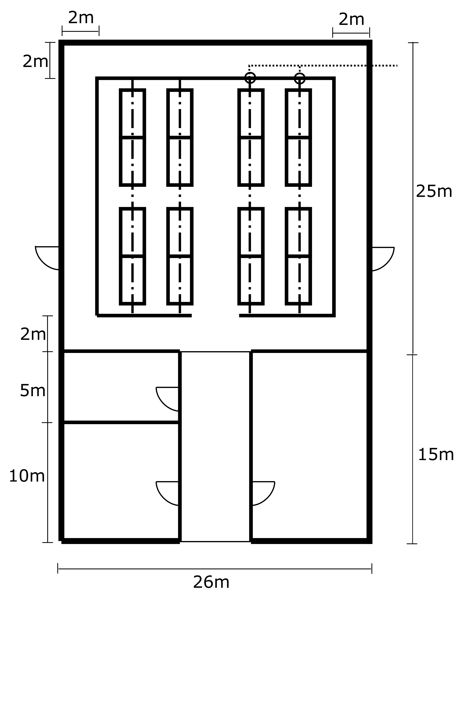

### Sieć Obliczeniowa

 - *NVIDIA MQM8790-HS2R Quantum HDR InfiniBand Switch*
 - *NVIDIA MCP1650-H00AE30 DAC 1m*
 - *NVIDIA MFS1S00-H015V AOC 15m*
 
---
### Administracyjna

 - Przełącznik *NVIDIA MSN4600-CS2F Spectrum-3 100GbE 2U Open Ethernet Switch* x 16 x 4 = **64**
 - Przewody miedziane *NVIDIA MCP1650-V001E30 DAC 1m* x **2560**
 - Przewody miedziane *NVIDIA MCP2M00-A005E26L DAC 5m* x 16 x 15 = **480**

---

### Dostępowa

 - Router *NVIDIA MGA100-HS2 Skyway* x 2
 - Przewody optyczne *NVIDIA MFS1S00-H015V AOC 15m* x 4

---

### Bezpieczeństwa

Potrzebne urządzenia:
- 25 kamer do monitoringu,
- 7 czytników NFC oraz kart dla każdego pracownika budynku,
- 12 czujników temperatury,
- 8 urządzeń chłodzących i 8 urządzeń pobierających ciepło,
- 40 czujników antywłamaniowych,
- 20 czujników dymu.

Potrzebny sprzęt:
- Ethernet kat.5E -> 3800m
- *Cisco CBS350-48T-4X-EU Managed 48-port GE*
- *Alantec 2xRJ45 IP54* 

---

# Plan adresacji

### Sieć obliczeniowa

Adresy w postaci 10.10.grupa.węzeł/16, gdzie węzły są pogrupowane według prznależności do szaf kolejno od 1 do 128. Adres 10.10.grupa.254/16 przynależy do przełącznika wyjściowego, a adresy 10.10.grupa.[250-253]/16 do przełączników w grupie elektrycznej.
   
### Sieć administracyjna

Adresy w postaci 40.40.grupa.węzeł/16, gdzie węzły są pogrupowane według prznależności do szaf kolejno od 1 do 128. Adres 40.40.grupa.254/16 przynależy do przełącznika wyjściowego, a adresy 40.40.grupa.[250-253]/16 do przełączników podłączonych do węzłów obliczeniowych.

---

### Sieć bezpieczeństwa

| Sieć                | Podsieć           | Adres            |
| ------------------- | ----------------- | ---------------- |
| sieć bezpieczeństwa | monitoring        | 192.168.0.0/27   |
| 192.168.0.0/24      | temperatura       | 192.168.0.32/27  |
|                     | pożar             | 192.168.0.64/27  |
|                     | dostęp i włamania | 192.168.0.128/26 |

---

## Plan budynku

### Pomieszczenia
 1. Pomieszczenie dla węzłów obliczeniowych
 2. Pomieszczenie dla ochrony
 3. Magazyn
 4. Schowek dla osób dbających o porządek

---

# Kosztorys

|                                                                 | Liczba | Cena         | Suma          |
| --------------------------------------------------------------- | ------ | ------------ | ------------- |
| *NVIDIA MQM8790-HS2R Quantum HDR InfiniBand Switch*             | 80     | $34,073.00   | $2,725,840.00 |
| *NVIDIA MSN4600-CS2F Spectrum-3 100GbE 2U Open Ethernet Switch* | 80     | $65,159.00   | $5,212,720.00 |
| *NVIDIA MCP1650-H00AE30 DAC 1m*                                 | 2560   | $351.00      | $898,560.00   |
| *NVIDIA MFS1S00-H015V AOC 15m*                                  | 244    | $2,282.00    | $556,808.00   |
| *NVIDIA MCP2M00-A005E26L DAC 5m*                                | 240    | $222.00      | $53,280.00    |
| *NVIDIA MCP1650-V001E30 DAC 1m*                                 | 2560   | $314.00      | $803,840.00   |
| *NVIDIA MGA100-HS2 Skyway*\*                                    | 2      | $55,795.00\* | $111,590.00   |
| *Cisco CBS350-48T-4X-EU Managed 48-port GE*                     | 6      | $1190.00     | $7140.00      |
| *Molex UTP Cat 5e LSOH*                                         | 3800m  | $0.50        | $1900.00      |
| *Alantec 2xRJ45 IP54 wall socket*                               | 6      | $130.00      | $780.00       |

\* Cena routera przed przejęciem firmy *Mellanox* przez *NVidia*

Suma: $10,362,638.00 + $9,820.00
